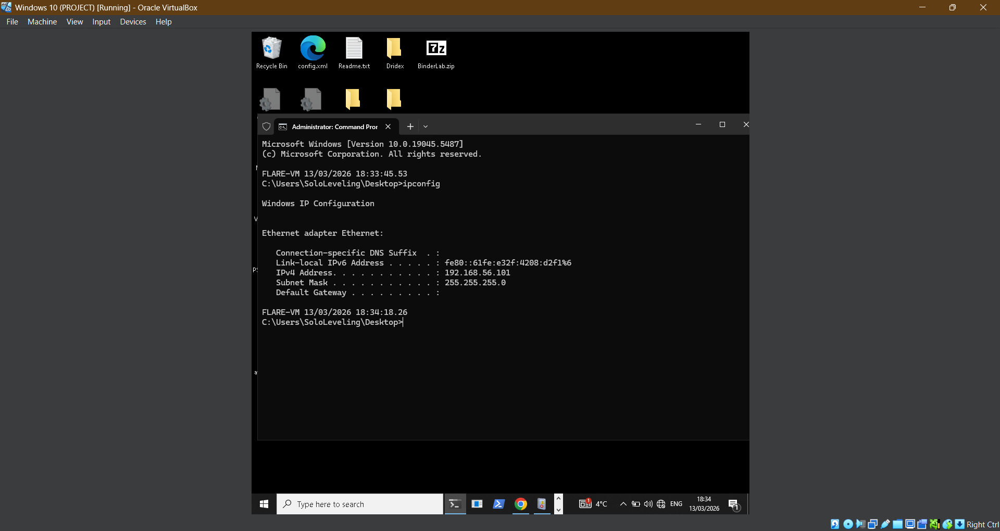
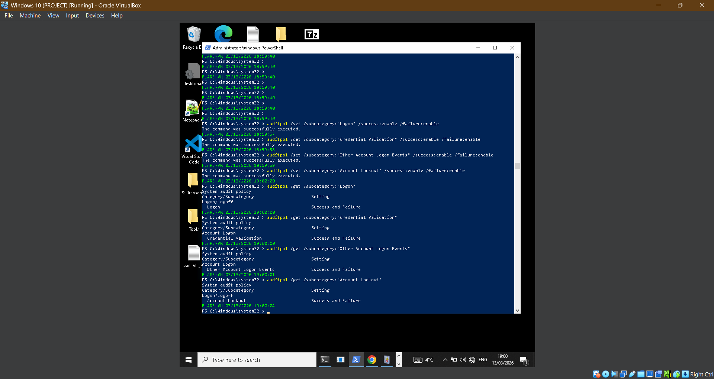
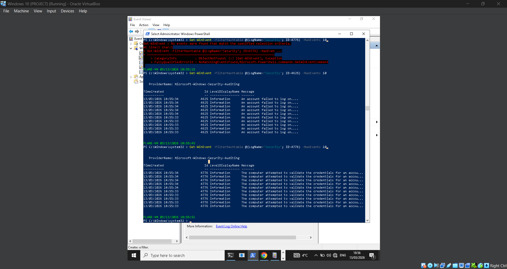
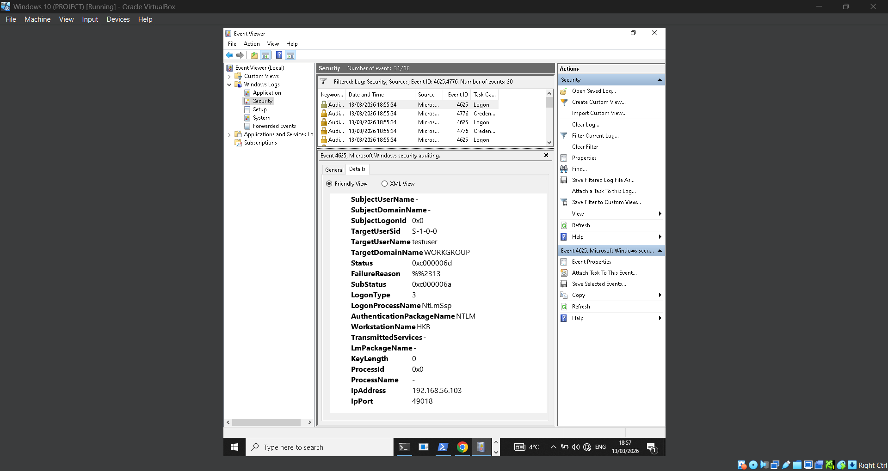
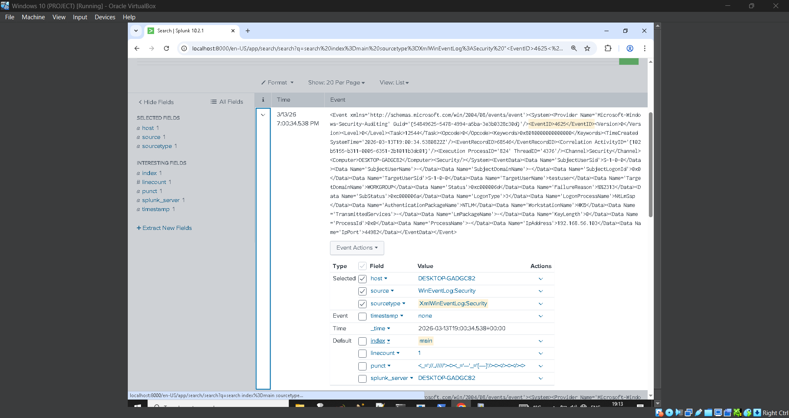
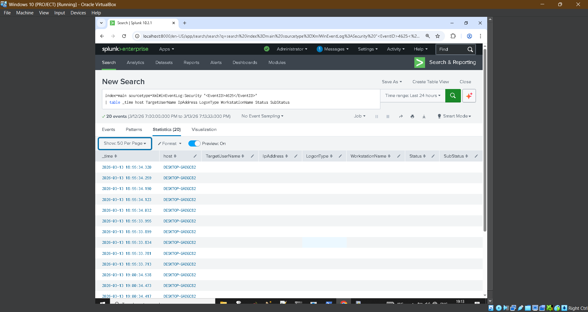
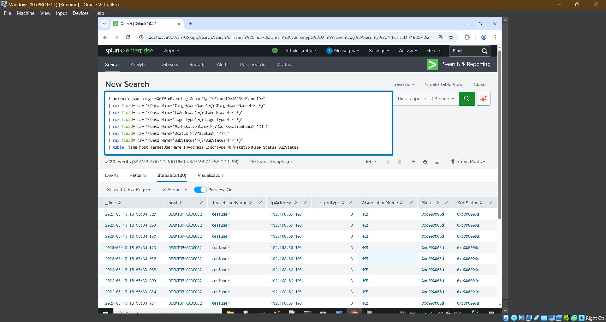

# Windows Brute Force Login Simulation

## Objective

Simulate repeated failed SMB authentication attempts from a Kali Linux attacker VM against a Windows 10 FLARE VM and detect the activity in Splunk using Windows Security Event Logs.

---

## MITRE ATT&CK Mapping

Tactic: Credential Access  
Technique: Brute Force  
Technique ID: T1110

---

## Lab Environment

Attacker Machine: Kali Linux VM  
Target Machine: Windows 10 FLARE VM  
SIEM: Splunk Enterprise  
Log Source: Windows Security Event Logs

---

## Target Information

Windows Host IP: 192.168.56.101



---

## Preconditions

Before running the attack simulation the following configurations were verified:

- Windows target IP address confirmed
- Network connectivity from Kali to Windows verified
- SMB service accessible on Windows
- Windows audit policies enabled

Enabled audit policies:

- Logon
- Credential Validation
- Other Account Logon Events
- Account Lockout



---

## Attack Simulation

A test account was targeted using repeated failed SMB authentication attempts.

Username used:

testuser

---

## Step 1 – Verify Network Connectivity

Command executed from Kali:

```
ping -c 4 192.168.56.101
```


---

## Step 2 – Attempt Single Failed Login

Command executed:

```
smbclient //192.168.56.101/SOCShare -U testuser%WrongPassword -c 'ls'
```

Expected output:

```
NT_STATUS_LOGON_FAILURE
```

---

## Step 3 – Simulate Brute Force Attempts

Command executed from Kali:

```
for i in {1..10}; do smbclient //192.168.56.101/SOCShare -U testuser%WrongPassword -c 'ls'; done
```


---

## Windows Log Evidence

The failed authentication attempts generate Windows Security log events.

Observed Event IDs:

4625 – An account failed to log on  
4776 – Credential validation attempt

---

## PowerShell Verification

Command used:

```
Get-WinEvent -FilterHashtable @{LogName="Security"; ID=4625} -MaxEvents 10
```



---

## Event Viewer Analysis

Event ID 4625 observed in Windows Security logs.

Important fields identified:

TargetUserName: testuser  
LogonType: 3  
AuthenticationPackageName: NTLM  
WorkstationName: HKB  
IpAddress: 192.168.56.103  
Status: 0xc000006d  
SubStatus: 0xc000006a  

These values indicate a failed network logon attempt caused by invalid credentials.




---

## Credential Validation Event

Windows also generated credential validation events.

Event ID: 4776


---

## Splunk Log Validation

The Windows Security logs were successfully ingested into Splunk.

Search query used:

```
index=main sourcetype=XmlWinEventLog:Security "<EventID>4625</EventID>"
```


---

## Field Extraction

XML event fields were extracted using regular expressions.

Extracted fields:

- TargetUserName
- IpAddress
- LogonType
- WorkstationName
- Status
- SubStatus







---

## Detection Logic

The detection identifies multiple failed logon attempts within a short time window.

Detection condition:

5 or more failed login attempts within 5 minutes.

Detection query:

```spl
index=main sourcetype=XmlWinEventLog:Security "<EventID>4625</EventID>"
| rex field=_raw "<Data Name='TargetUserName'>(?<TargetUserName>[^<]+)"
| rex field=_raw "<Data Name='IpAddress'>(?<IpAddress>[^<]+)"
| rex field=_raw "<Data Name='LogonType'>(?<LogonType>[^<]+)"
| rex field=_raw "<Data Name='WorkstationName'>(?<WorkstationName>[^<]+)"
| bin _time span=5m
| stats count values(IpAddress) as src_ip values(WorkstationName) as workstation values(LogonType) as logon_type by _time TargetUserName
| where count >= 5
| sort - count
```

---

## Detection Result

The query successfully detected repeated failed authentication attempts originating from the Kali attacker machine.

