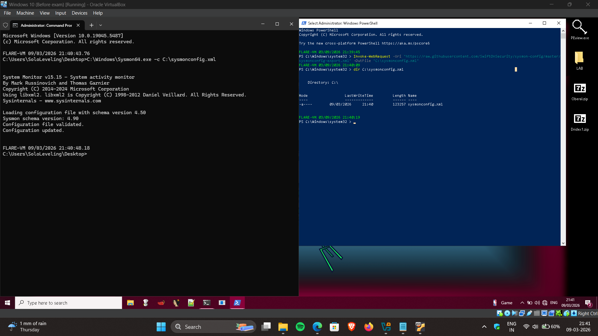
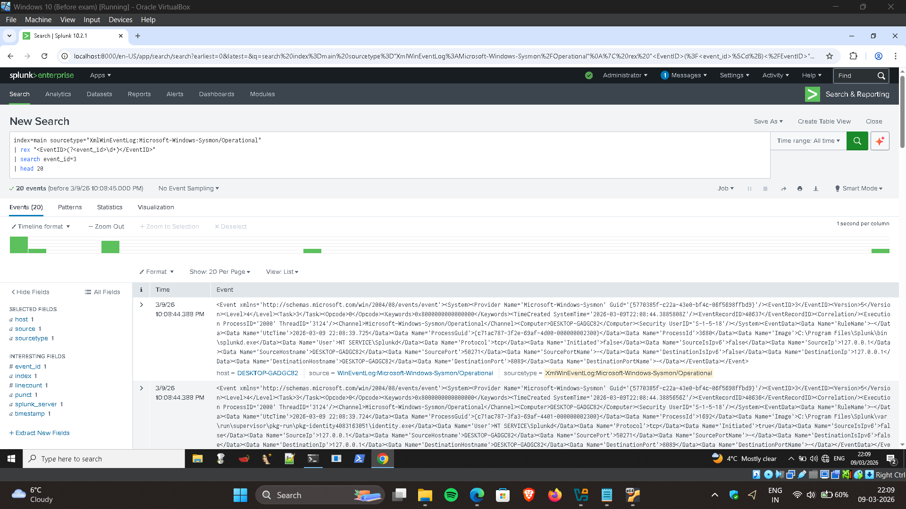

# Lab Setup

## Objective

Build a SOC-style detection engineering lab using Splunk Enterprise, Sysmon, a Windows 10 FLARE VM, and a Kali Linux attacker VM.

The goal of the lab is to generate security telemetry, ingest logs into Splunk SIEM, and verify that system events can be monitored and analyzed.

---

## Lab Architecture

Target System

- Windows 10 FLARE VM
- Splunk Enterprise 10.2.1
- Sysmon

Attacker System

- Kali Linux
- Nmap

Virtualization Platform

- Oracle VirtualBox

---

## Network Design

The lab used VirtualBox **Host-Only Networking** so the attacker and target systems could communicate without exposing the lab externally.

Observed IP addresses:

- Windows target VM: `192.168.56.101`
- Kali attacker VM: `192.168.56.103`

---

## Splunk Installation

Splunk Enterprise was installed on the Windows 10 FLARE VM to collect and analyze system telemetry.

Key details:

- Splunk Enterprise Version: **10.2.1**
- Web Interface: `http://localhost:8000`
- Management Port: `8089`

### Splunk Login

### Splunk Dashboard

### Splunk Version

---

## Sysmon Deployment

Sysmon was installed to provide enhanced endpoint telemetry including process activity, network connections, file creation, and registry changes.

The configuration file was applied using:

Sysmon64.exe -c C:\sysmonconfig.xml

The command output confirmed the configuration was validated and successfully applied.

---

## Log Ingestion Verification

After installing Sysmon, logs were verified inside Splunk.

Sysmon logs appear under the sourcetype:

XmlWinEventLog:Microsoft-Windows-Sysmon/Operational

### Sysmon Logs in Splunk

### Event ID Distribution

Observed Sysmon events included:

| Event ID | Description |
|--------|-------------|
| 1 | Process creation |
| 3 | Network connection |
| 5 | Process termination |
| 11 | File creation |
| 22 | DNS query |

### Network Telemetry Example

This confirmed the Windows system telemetry was successfully being collected by Splunk.